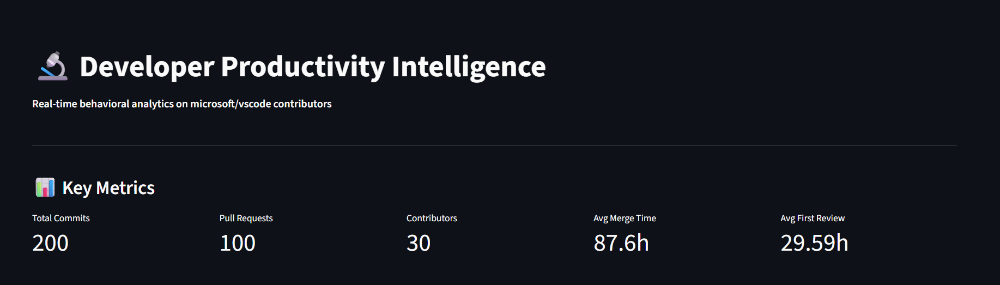
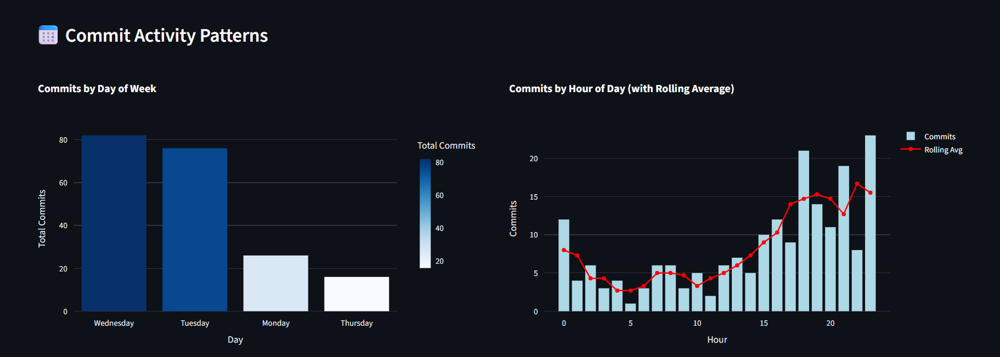
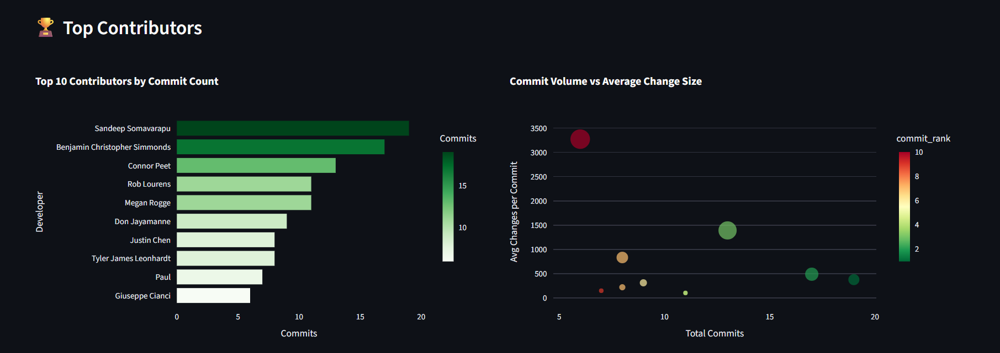
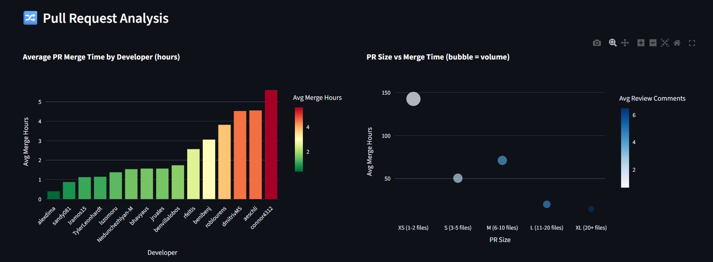
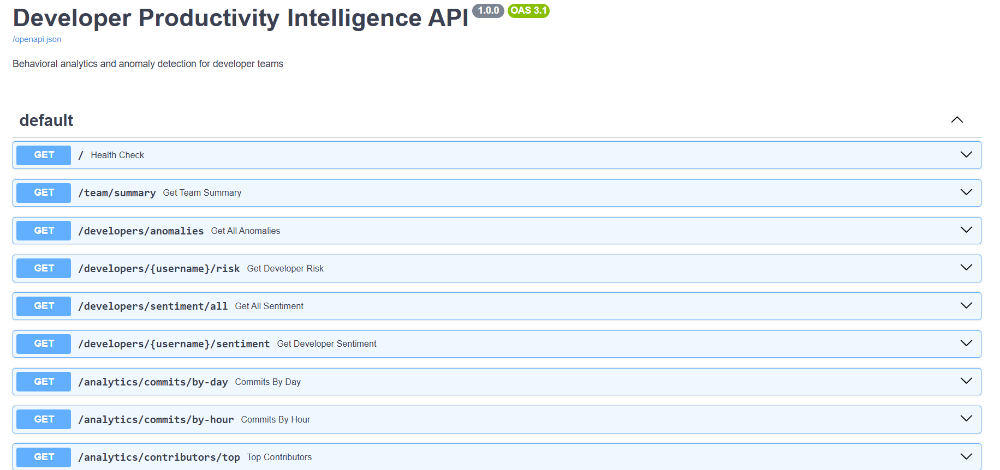

# 🔬 Developer Productivity Intelligence Platform

> End-to-end behavioral analytics and anomaly detection system for engineering teams — built with Python, SQL, Machine Learning, NLP, and REST API.

---
## 📸 Screenshots

### Dashboard — Key Metrics

### Commit Activity Patterns

### Top Contributors Analysis

### Pull Request Analysis

### REST API — Swagger UI

---
## 🎯 Problem Statement

Engineering managers have no objective way to detect when developers are struggling, blocked, or burning out — until it's too late. Existing tools count commits and PRs but don't analyze **behavioral patterns**.

This system pulls real developer activity from GitHub, analyzes behavioral signals using ML models, detects anomalies, and surfaces risk through an interactive dashboard and REST API.

---

## 🏗️ System Architecture